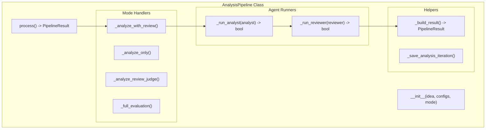
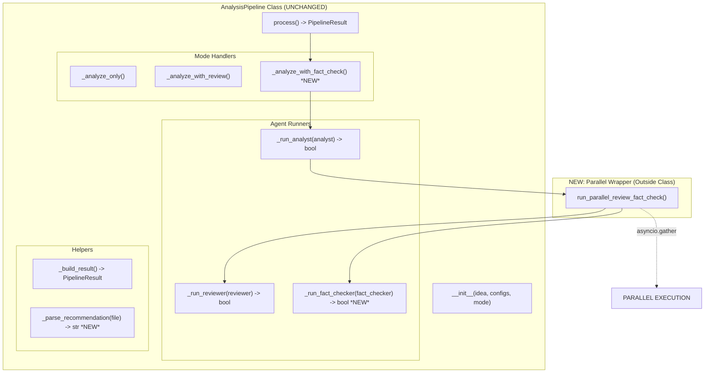

# Pipeline Architecture: Current vs Proposed

## Current Architecture (Sequential)



### Current Flow Detail: _analyze_with_review()

```text
┌─────────────────────────────────────────────────────────────┐
│ _analyze_with_review()                                       │
├─────────────────────────────────────────────────────────────┤
│ Input: self (with idea, configs)                             │
│ Output: PipelineResult                                       │
└─────────────────────────────────────────────────────────────┘
                            │
                            ▼
┌─────────────────────────────────────────────────────────────┐
│ ITERATION LOOP (1 to max_iterations)                         │
│                                                               │
│   ┌────────────────────────────────────┐                    │
│   │ _run_analyst(analyst)              │                    │
│   ├────────────────────────────────────┤                    │
│   │ Input: AnalystAgent                │                    │
│   │ Creates: AnalystContext            │                    │
│   │   - idea_slug                      │                    │
│   │   - analysis_output_path           │                    │
│   │   - feedback_input_path            │                    │
│   │   - iteration                      │                    │
│   │ Calls: analyst.process(idea, ctx)  │                    │
│   │ Output: bool (success/fail)        │                    │
│   └────────────────────────────────────┘                    │
│                     │                                        │
│                     ▼                                        │
│   ┌────────────────────────────────────┐                    │
│   │ _run_reviewer(reviewer)            │                    │
│   ├────────────────────────────────────┤                    │
│   │ Input: ReviewerAgent               │                    │
│   │ Creates: ReviewerContext           │                    │
│   │   - analysis_input_path            │                    │
│   │   - feedback_output_path           │                    │
│   │   - iteration                      │                    │
│   │ Calls: reviewer.process("", ctx)   │                    │
│   │ Parses: feedback.json              │                    │
│   │ Output: bool (continue/stop)       │                    │
│   └────────────────────────────────────┘                    │
│                                                               │
└─────────────────────────────────────────────────────────────┘
                            │
                            ▼
┌─────────────────────────────────────────────────────────────┐
│ _build_result()                                              │
├─────────────────────────────────────────────────────────────┤
│ Input: self.current_analysis_file, self.last_feedback_file   │
│ Output: PipelineResult dict                                  │
└─────────────────────────────────────────────────────────────┘
```

## Proposed Architecture with Option B (Parallel Wrapper)



### Proposed Flow Detail: Option B Implementation

```text
┌─────────────────────────────────────────────────────────────┐
│ _analyze_with_fact_check() *NEW MODE HANDLER*                │
├─────────────────────────────────────────────────────────────┤
│ Input: self (with idea, configs, fact_checker_config)        │
│ Output: PipelineResult                                       │
└─────────────────────────────────────────────────────────────┘
                            │
                            ▼
┌─────────────────────────────────────────────────────────────┐
│ ITERATION LOOP (1 to max_iterations)                         │
│                                                               │
│   ┌────────────────────────────────────┐                    │
│   │ _run_analyst(analyst)              │                    │
│   ├────────────────────────────────────┤                    │
│   │ [UNCHANGED FROM CURRENT]           │                    │
│   └────────────────────────────────────┘                    │
│                     │                                        │
│                     ▼                                        │
│   ┌────────────────────────────────────────────────────┐    │
│   │ run_parallel_review_fact_check() *NEW WRAPPER*      │    │
│   ├────────────────────────────────────────────────────┤    │
│   │ Input: pipeline, reviewer, fact_checker             │    │
│   │                                                      │    │
│   │   ┌─────────────────────────────────────────┐      │    │
│   │   │ asyncio.gather(                         │      │    │
│   │   │   pipeline._run_reviewer(reviewer),     │      │    │
│   │   │   pipeline._run_fact_checker(checker),  │      │    │
│   │   │   return_exceptions=True                │      │    │
│   │   │ )                                        │      │    │
│   │   └─────────────────────────────────────────┘      │    │
│   │                                                      │    │
│   │         ┌──────────────┐  ┌──────────────┐        │    │
│   │         │ _run_reviewer │  │ _run_fact_   │        │    │
│   │         │               │  │ checker      │        │    │
│   │         │ [UNCHANGED]   │  │ [NEW: SIMPLE │        │    │
│   │         │               │  │  COPY OF     │        │    │
│   │         │               │  │  REVIEWER]   │        │    │
│   │         └──────────────┘  └──────────────┘        │    │
│   │               │                    │                │    │
│   │               ▼                    ▼                │    │
│   │         feedback.json        fact_check.json       │    │
│   │                                                      │    │
│   │   ┌─────────────────────────────────────────┐      │    │
│   │   │ Veto Logic:                             │      │    │
│   │   │ review_rec = parse(feedback.json)       │      │    │
│   │   │ check_rec = parse(fact_check.json)      │      │    │
│   │   │ both_approved = (review_rec == "approve"│      │    │
│   │   │                  AND check_rec == "approve")│   │    │
│   │   └─────────────────────────────────────────┘      │    │
│   │                                                      │    │
│   │ Output: bool (continue if not both_approved)        │    │
│   └────────────────────────────────────────────────────┘    │
│                                                               │
└─────────────────────────────────────────────────────────────┘
                            │
                            ▼
┌─────────────────────────────────────────────────────────────┐
│ _build_result() [UNCHANGED]                                  │
└─────────────────────────────────────────────────────────────┘
```

## Key Simplifications with Option B

### 1. Minimal Class Changes

```python
# Only 2 additions to AnalysisPipeline class:

# 1. New mode handler (copy of _analyze_with_review with one line changed)
async def _analyze_with_fact_check(self) -> PipelineResult:
    # ... same as _analyze_with_review except:
    should_continue = await run_parallel_review_fact_check(
        self, reviewer, fact_checker
    )

# 2. New agent runner (copy of _run_reviewer for fact-checker)
async def _run_fact_checker(self, fact_checker: FactCheckerAgent) -> bool:
    # ... same pattern as _run_reviewer
```

### 2. Parallel Logic Outside Class

```python
# New standalone function (not a method):
async def run_parallel_review_fact_check(
    pipeline: AnalysisPipeline,
    reviewer: ReviewerAgent,
    fact_checker: FactCheckerAgent
) -> bool:
    """
    Simple wrapper that calls existing methods in parallel.
    No new abstractions, just asyncio.gather().
    """
    results = await asyncio.gather(
        pipeline._run_reviewer(reviewer),
        pipeline._run_fact_checker(fact_checker),
        return_exceptions=True
    )
    
    # Handle errors
    if any(isinstance(r, Exception) for r in results):
        return True  # Continue iterating on error
    
    # Veto power: both must approve to stop
    reviewer_approved, checker_approved = results
    return not (reviewer_approved and checker_approved)
```

## Data Flow Comparison

### Current (Sequential)

```text
Iteration 1:
  Analyst writes → analysis_1.md
  Reviewer reads analysis_1.md → writes feedback_1.json
  Pipeline reads feedback_1.json → decides continue/stop

Iteration 2:
  Analyst reads feedback_1.json → writes analysis_2.md
  Reviewer reads analysis_2.md → writes feedback_2.json
  Pipeline reads feedback_2.json → decides continue/stop
```

### Proposed (Parallel)

```text
Iteration 1:
  Analyst writes → analysis_1.md
  ┌─ Reviewer reads analysis_1.md → writes feedback_1.json
  └─ FactChecker reads analysis_1.md → writes fact_check_1.json
  Pipeline reads both JSONs → applies veto logic → decides continue/stop

Iteration 2:
  Analyst reads feedback_1.json → writes analysis_2.md
  ┌─ Reviewer reads analysis_2.md → writes feedback_2.json
  └─ FactChecker reads analysis_2.md → writes fact_check_2.json
  Pipeline reads both JSONs → applies veto logic → decides continue/stop
```

## Why Option B Is Superior

### 1. **Zero Breaking Changes**

- All existing methods remain untouched
- New functionality is purely additive
- Existing tests continue to pass

### 2. **Clear Separation of Concerns**

- AnalysisPipeline keeps its current responsibilities
- Parallel logic is isolated in one function
- Easy to understand and debug

### 3. **Testability**

```python
# Can test parallel wrapper independently
async def test_parallel_wrapper():
    mock_pipeline = MagicMock()
    mock_pipeline._run_reviewer.return_value = True
    mock_pipeline._run_fact_checker.return_value = False
    
    result = await run_parallel_review_fact_check(
        mock_pipeline, mock_reviewer, mock_checker
    )
    
    # Both methods were called
    assert mock_pipeline._run_reviewer.called
    assert mock_pipeline._run_fact_checker.called
```

### 4. **Progressive Enhancement**

- Start with sequential fact-checking (just add _run_fact_checker)
- Add parallel wrapper when ready
- Can easily switch between sequential/parallel with feature flag

## Implementation Steps

```text
Step 1: Add _run_fact_checker() method (10 min)
        ↓ (Copy _run_reviewer, change file names)
        
Step 2: Add run_parallel_review_fact_check() wrapper (10 min)
        ↓ (Simple asyncio.gather of two existing methods)
        
Step 3: Add _analyze_with_fact_check() handler (5 min)
        ↓ (Copy _analyze_with_review, change one line)
        
Step 4: Wire up in process() method (5 min)
        ↓ (Add case for new PipelineMode)
        
Step 5: Test (30 min)
        ↓
        
Done: Total 1 hour
```

## Summary

Option B achieves parallel execution by:

1. **Reusing** existing `_run_reviewer()` pattern for fact-checker
2. **Adding** simple wrapper function for parallel execution
3. **Maintaining** all existing code paths unchanged
4. **Isolating** parallel logic in one testable function

The beauty is that `run_parallel_review_fact_check()` is just a **coordinator** - it doesn't know about contexts, file paths, or business logic. It just runs two existing methods in parallel and combines their results.

This is the minimal change that adds maximum capability.
