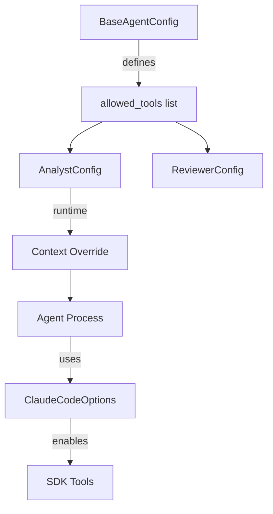

# Prompt Standardization Implementation Plan

**Date**: 2025-08-26  
**Author**: Claude Code  
**Status**: Ready for Implementation  

## Executive Summary

This document outlines the plan to standardize prompts across the idea-assess system by:

1. Making the citation-strict experimental prompt the default for improved accuracy
2. Creating agent-specific tools system prompts that accurately document each agent's capabilities
3. Including these tools prompts in agent system prompts via `{{include:}}` directives
4. Ensuring accurate and consistent tool guidance for each agent based on their actual tools

## Current State Analysis

### Prompt Architecture

The system uses a hierarchical prompt structure with includes:

```text
config/prompts/
├── agents/
│   ├── analyst/
│   │   ├── system.md          # Current default (v4)
│   │   └── user/
│   │       ├── initial.md     # Includes tools.md
│   │       ├── revision.md    # Includes tools.md
│   │       └── tools.md       # Tools guidance (user-level)
│   ├── reviewer/
│   │   ├── system.md          # Current default (v2)
│   │   └── user/
│   │       └── review.md      # Review instructions
├── experimental/
│   └── analyst/
│       └── citation-strict.md # Improved citation accuracy
└── shared/
    └── file_edit_rules.md     # Shared file operation rules
```

### Key Findings

#### 1. Citation Accuracy Problem

Based on analysis in `session-logs/2025-08-26-citation-analysis-findings.md`:

- **Baseline prompt**: 70% citation failure rate (7/10 citations false/unverifiable)
- **Citation-strict prompt**: 33% failure rate (2/6 citations with issues)
- **Improvement**: 2.5x better accuracy with citation-strict variant

#### 2. Tools Configuration

Currently tools are configured at multiple levels:

1. **Config level** (`src/core/config.py`):
   - AnalystConfig: `["WebSearch", "WebFetch", "TodoWrite"]`
   - ReviewerConfig: `[]` (no tools)

2. **Runtime level** (`src/agents/analyst.py`):
   - Tools can be overridden via context
   - Tool status variables built dynamically

3. **Prompt level** (`config/prompts/agents/analyst/user/tools.md`):
   - User-level instructions about tools
   - Included via `{{include:}}` directive
   - Contains placeholders like `{max_turns}`, `{web_tools_status}`

#### 3. System vs User Prompts

- **System prompts**: Define agent role and principles
- **User prompts**: Provide specific task instructions and tool guidance
- **Shared components**: File edit rules included in both analyst and reviewer system prompts

## Proposed Changes

### 1. Make Citation-Strict the Default

**File**: `config/prompts/agents/analyst/system.md`

**Change**: Replace current content with citation-strict version

**Key Additions**:

- Strict citation rules section
- Verification requirements
- Examples of good vs bad citations
- Instructions to use WebFetch for verification

### 2. Create Agent-Specific Tools System Prompts

**Solution**: Create separate tool prompts for each agent, respecting their different capabilities.

**New File 1**: `config/prompts/agents/analyst/tools_system.md`

**Content**: Tools guidance specific to analyst capabilities:

```markdown
## Analyst Tools and Usage

You have access to the following tools for research and analysis:

### WebSearch
- Find recent market data, competitor information, and industry trends
- Prioritize 2024-2025 sources
- Look for specific metrics and verifiable numbers
- Maximum searches available: configured per analysis

### WebFetch  
- Deep-dive into promising URLs for detailed data extraction
- **CRITICAL**: Use this to verify statistics before citing them
- If a source returns 403/404, do not make claims based on it
- Always verify key claims with WebFetch before including in citations

### TodoWrite
- Organize complex multi-faceted analyses
- Use for ideas requiring multiple research threads
- Keep light: 5-8 tasks maximum
- Skip for simple, straightforward ideas

### Edit/MultiEdit
- ALWAYS Read files before editing
- Complete all research before starting edits
- Use single Edit operation for full template replacement
- Follow file_edit_rules for proper workflow
```

**New File 2**: `config/prompts/agents/reviewer/tools_system.md`

**Content**: Minimal tools guidance for reviewer (currently has no external tools):

```markdown
## Reviewer Tools and Usage

You have access to file operations for reviewing and providing feedback:

### Read
- Read analysis files to understand content
- Always read before attempting to edit

### Edit/MultiEdit
- Edit feedback template files
- Complete your review before starting edits
- Use single Edit operation for full template replacement
- Follow file_edit_rules for proper workflow

Note: You do not have access to web research tools. Focus on the quality and completeness of the analysis document itself.
```

### 3. Tools-Related Content Overlap Analysis

**Scanning Results**: Checked all system prompts for tools-related content to avoid duplication:

#### Current Analyst System Prompt (system.md)

- **Research Approach section**: Generic guidance about prioritizing recent data
- **No specific tool mentions**: Clean, no overlap concerns

#### Citation-Strict Prompt (experimental)

- **WebFetch mentions**: 3 references in citation verification context
  - Line 5: "VERIFY citations - If WebFetch is available..."
  - Line 39: "Verify when possible - IF WebFetch is available..."
  - Line 93: "IF WebFetch available: Verify statistics..."
- **These should remain**: They're conditional guidance tied to citation accuracy

#### Reviewer System Prompt

- **No tools content**: Completely clean

#### Shared file_edit_rules.md

- **Heavy tool usage**: Read, Edit, Write, MultiEdit, WebSearch, WebFetch, TodoWrite
- **This is fine**: It's about file operation workflow, not tool capabilities
- **Keep as-is**: Different purpose than tools_system.md

**Conclusion**: No problematic overlaps. The citation-strict prompt's WebFetch mentions are appropriate conditional guidance that complement the tools documentation.

### 4. Update Agent System Prompts

#### Analyst System Prompt

Add after line 9 (after file_edit_rules include):

```markdown
{{include:agents/analyst/tools_system.md}}
```

#### Reviewer System Prompt Update

Add after line 9 (after file_edit_rules include):

```markdown
{{include:agents/reviewer/tools_system.md}}
```

Note: Each agent includes its own tools documentation, ensuring accuracy about available capabilities.

<!-- FEEDBACK: Also, scan existing system.md files to make sure there's no overlap over tools-related information in the updated system prompt -->
### 4. Clean Up User-Level Tools Instructions

**File**: `config/prompts/agents/analyst/user/tools.md`

**Changes**: Keep user-level specifics, remove system-level guidance:

- Keep: Turn limits, search limits, efficiency guidelines
- Keep: Dynamic placeholders (`{max_turns}`, etc.)
- Remove: Duplicate tool descriptions that move to system prompt

## Implementation Steps

### Phase 1: Backup Current State

```bash
# Create backups
cp config/prompts/agents/analyst/system.md config/prompts/versions/analyst/analyst_v4.md
cp config/prompts/experimental/analyst/citation-strict.md config/prompts/versions/analyst/analyst_v5_citation_strict.md
```

### Phase 2: Create Agent-Specific Tools Prompts

1. Create `config/prompts/agents/analyst/tools_system.md`
   - Document WebSearch, WebFetch, TodoWrite, Edit tools
   - Emphasize citation verification with WebFetch
   - **Include template variables**: `{max_turns}`, `{max_websearches}`, `{web_tools_status}`, `{web_tools_instruction}`
2. Create `config/prompts/agents/reviewer/tools_system.md`
   - Document Read and Edit tools only
   - Note absence of web research capabilities

### Phase 3: Update System Prompts

1. Replace `config/prompts/agents/analyst/system.md` with citation-strict content
2. Add `{{include:agents/analyst/tools_system.md}}` to analyst system prompt
3. Add `{{include:agents/reviewer/tools_system.md}}` to reviewer system prompt
4. Update line numbers in prompt comments if needed

### Phase 4: Update Source Code to Format System Prompts

The key insight is that `load_prompt_with_includes()` handles the include directives but returns a string that may still contain template variables. These need to be formatted at runtime with the actual values.

**In `src/agents/analyst.py`**:

```python
# Line 85 - Load the system prompt with includes processed
system_prompt_template = load_prompt_with_includes(
    self.get_system_prompt_path(), self.config.prompts_dir
)

# Build dynamic variables for tools configuration
web_tools_enabled = "WebSearch" in allowed_tools or "WebFetch" in allowed_tools
web_tools_status = "Enabled" if web_tools_enabled else "Disabled"
web_tools_instruction = (
    "Use WebSearch and WebFetch to research recent market data and verify claims."
    if web_tools_enabled
    else "Web tools are disabled. Rely on your training knowledge for market insights."
)

# Format the system prompt with runtime variables
system_prompt = system_prompt_template.format(
    max_turns=self.config.max_turns,
    max_websearches=self.config.max_websearches,
    web_tools_status=web_tools_status,
    web_tools_instruction=web_tools_instruction,
)
```

This approach:

- Uses the existing `load_prompt_with_includes()` utility to handle includes
- Formats the resulting template string with runtime variables
- Keeps changes minimal and leverages existing patterns
- Mirrors how user prompts are already handled (load then format)

### Phase 4: Testing

1. Run unit tests to ensure no breakage:

   ```bash
   python -m pytest tests/ -xvs
   ```

2. Run integration test with new prompts:

   ```bash
   python -m src.cli "AI tutoring platform" --slug-suffix "new-prompts"
   ```

3. Compare output quality with previous versions

### Phase 5: Update Documentation

1. Update `config/prompts/README.md` to reflect new structure
2. Update `system-architecture.md` prompt section if needed
3. Add notes about citation-strict becoming default

## Risk Analysis

### Low Risk

- **Prompt changes**: System designed for prompt flexibility
- **Include directives**: Already working in multiple places
- **Citation improvements**: Strictly better accuracy

### Medium Risk

- **Tool guidance duplication**: Need to ensure no conflicts between system and user prompts
- **Test coverage**: Some tests may expect specific prompt content

### Mitigation

- Keep backups of all original prompts
- Run full test suite before committing
- Test with actual analysis to verify quality

## Success Metrics

1. **Citation Accuracy**: Reduce false citations from 70% to <35%
2. **WebFetch Usage**: Increase from 0 to 2+ per analysis
3. **Test Coverage**: All tests continue to pass
4. **Analysis Quality**: Maintain or improve overall quality scores

## Why Agent-Specific Tool Prompts

After feedback, the approach was revised from a shared tools prompt to agent-specific ones because:

1. **Different Tool Sets**: Analyst has WebSearch/WebFetch/TodoWrite, Reviewer has none
2. **Accuracy**: Each agent's prompt accurately describes only its available tools
3. **Flexibility**: Easy to update tools for one agent without affecting others
4. **Clarity**: No confusion about which tools are actually available
5. **Future-Proof**: If reviewer gets tools later, easy to update its specific prompt

## Alternative Approaches Considered

### Option A: Shared Tools Prompt (Initial Approach)

- **Pros**: Single source of truth for tool documentation
- **Cons**: Tools are agent-specific, would be misleading
- **Decision**: Rejected after feedback - agent-specific is more accurate

### Option B: Separate Citation-Verifier Agent

- **Pros**: Clean separation of concerns
- **Cons**: Additional complexity, more API calls
- **Decision**: Rejected - prompt improvements sufficient

### Option C: Reviewer Does Citation Checking

- **Pros**: Second pass validation
- **Cons**: Reviewer lacks web tools currently
- **Decision**: Deferred - could add later if needed

### Option D: Keep Experimental Prompt Separate

- **Pros**: Preserves original for comparison
- **Cons**: Maintains two versions, confusion about which to use
- **Decision**: Rejected - citation-strict is strictly better

### Option E: Inline Tools in System Prompts

- **Pros**: No extra files, simpler structure
- **Cons**: Duplication if tools documentation needs updates
- **Decision**: Rejected - includes provide better modularity

## Timeline

- **Preparation**: 15 minutes (backups, plan review)
- **Implementation**: 30 minutes (file changes)
- **Testing**: 30 minutes (unit tests, integration test)
- **Documentation**: 15 minutes (README updates)
- **Total**: ~90 minutes

## Rollback Plan

If issues arise:

1. Restore from backups:

   ```bash
   cp config/prompts/versions/analyst/analyst_v4.md config/prompts/agents/analyst/system.md
   ```

2. Remove agent-specific tools prompts:

   ```bash
   rm config/prompts/agents/analyst/tools_system.md
   rm config/prompts/agents/reviewer/tools_system.md
   ```

3. Remove include directives from system prompts

4. Re-run tests to verify restoration

## Next Steps After Implementation

1. **Monitor**: Track citation accuracy in new analyses
2. **Iterate**: Further refine prompts based on results
3. **Extend**: Consider adding WebFetch to reviewer for fact-checking
4. **Document**: Update user guides with new citation standards

---

## Appendix: Detailed File Changes

### A. Full Citation-Strict Prompt Content

The citation-strict prompt adds these key sections not in current default:

```markdown
## Citation Accuracy Requirements

### Strict Citation Rules

1. **Only cite what you can verify** - NEVER cite statistics not explicitly stated in sources
2. **No fabricated numbers** - If you can't find a specific metric, don't make one up
3. **No misattribution** - Don't attribute generic industry stats to specific companies
4. **Verify when possible** - IF WebFetch is available in your tools, use it to verify key statistics
5. **Omit rather than fabricate** - If source is inaccessible or data unavailable, make NO claim
```

### B. Tools Configuration Flow



### C. Include Processing Order

1. System prompt loaded via `load_prompt_with_includes()`
2. Processes `{{include:shared/file_edit_rules.md}}`
3. Processes `{{include:agents/[agent]/tools_system.md}}` (NEW, agent-specific)
4. User prompt loaded separately
5. User prompt processes its own includes (e.g., tools.md for analyst)

---

*Plan created: 2025-08-26 19:30 PDT*  
*Plan updated: 2025-08-26 19:48 PDT (agent-specific tool prompts)*  
*Plan updated: 2025-08-26 19:54 PDT (overlap analysis added)*
